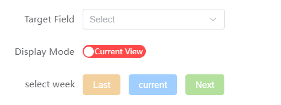

# Time Week Filter

This is a date-based conditional filtering plugin designed for Lark multi-dimensional tables. <br>
This is a full-stack project developed using Nuxt, hoping it can help you complete tasks efficiently.

## Setup

Make sure to install the dependencies:

```bash
# pnpm
pnpm install
```

## Development Server

Start the development server on `http://localhost:3000`:

```bash
# pnpm
pnpm run dev
```

## Production

Build the application for production:

```bash
# pnpm
pnpm run build
```
Locally preview production build:

```bash
# pnpm
pnpm run preview
```

## How to use

> Note, before proceeding, you need to configure your relevant information in the .> env file
> ```js
> APP_TOKEN=xxx
> PERSONAL_BASE_TOKEN=xxx
> TABLE_ID=xxx
> ```


The plugin interface is as follows：<br/>


1. First, select the column where you'd like to filter dates.
2. Next, decide how you'd like the filtered results to be displayed: in a new view or the existing one?
3.  Click the button to apply the filter.

